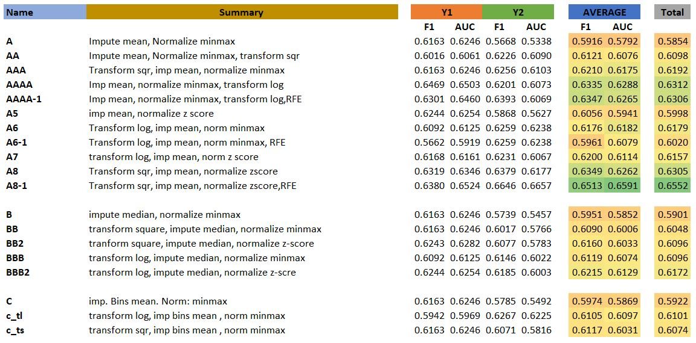
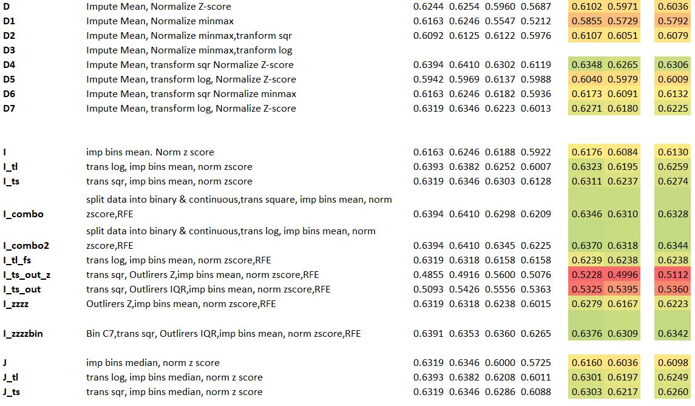

# Charles F. Dolan School of Business

# BA 545 – Data Mining, Competition#1, SP 2019

## 3 musketeers

**Goal:** The goal of this project was to answer the analytical question &quot;What are the determinants of IPO underpricing phenomena?&quot; for the data given subject to the evaluation code period for the two metrics &quot;Prediction Accuracy&quot; and &quot;Predictive Power&quot;

**Explanation of Work:**

- The Team began the project by examining each of the attributes and getting an understanding of what each one of them meant. Any background knowledge of finance and company listings the group had and google were used to aid our understanding of the data; 
**[Outline](Outline.txt)**

- After some initial EDA the group attempted to built a &quot;perfect dataset&quot; however, after discussions with Dr. Tao we realised this was not the optimal strategy for this project. We instead should be focusing our efferts on more broad methods that can later be fine tuned owe have a better understanding of the dataset. We also realised by trying to build a &quot;perfect model&quot; from the beginning it was possible we coud ealiy miss a better solution.

To acceess our EDA Report please right-click on link and select open in new browser tab: **[EDA Report](df_profile_report.html)**

- Thus, the group built a universal &quot;configure Dataset.py&quot; that we can call on the data to set up the dataset the same way at the beginning for each method we wanted to attempt. In summary the configure dataset.py performs the following functions; **[Configure](Configure_Dataset.py)**
  -  Imports standard imports
  - Reads the excel file as a pandas dataframe
  - Replaces the missing SIC codes with values that the group sourced from EDGAR: https://www.sec.gov/edgar/searchedgar/companysearch.html
  - Replaces &quot;-&quot; with NaN. Drops all Pricing variables where there are missing values (these need to be dropped as the pricing variables are used to calculate the target variables and therefore imputing missing values is inappropriate). We also drop the company name and ticker symbol as these are irrelevant for our models.
  - Calculate the target variables Y1 and Y2 and control variables
  - Calculate ratios based on the S and T variables; we calculated the percentage of long sentences, long words, positive words, negative words and uncertain words
  - Binned column I3 (&quot;company sic codes&quot;) initially on the 12 categories per the sec website;

|  SIC CODES  |      Industry     |  
|----------|-------------|
| 100-999|	Agriculture, Forestry and Fishing |
| 1000-1499 |    Mining  |   
| 1500-1799| Construction |   
| 1800-1999| not used |    
| 2000-3999| Manufacturing|   
| 4000-4999| Transportation, Communications, Electric, Gas and Sanitary service |  
| 5000-5199| Wholesale Trade |   
| 5200-5999| Retail Trade |  
| 6000-6799| Finance, Insurance and Real Estate |   
| 7000-8999| Services |  
| 9100-9729| Public Administration |   
| 9900-9999| Nonclassifiable | 

 We then reduced this to 3 bins; &quot;Manufacturing&quot;, &quot;public Services&quot; and &quot;Other&quot;. The 3 bins were then &quot;one-hot encoded&quot;

  - Irreleant columns were dropped.(&quot; &#39;Bins&#39;, &#39;p\_mid&#39;, &#39;I3&#39;, &#39;P(IPO)&#39;, &#39;P(H)&#39;, &#39;P(L)&#39;, &#39;P(1Day)&#39;, &#39;fraction&#39;, &#39;C3&#39;, &#39;C5&#39;, &#39;C6&#39;, &#39;T1&#39;, &#39;T2&#39;, &#39;T3&#39;, &#39;T4&#39;, &#39;T5&#39;, &#39;S1&#39;, &#39;S2&#39;, &#39;S3&#39;, &#39;Y1&#39;, &#39;Y2&#39;)

- Modules were built for each step in the data processing stage. These modules allow use to call the steps in any order and also mean the code is reproduceable for each model or pipeline we attempt. The modules are listed below and a brief explanation of the functions within each:
  - **[Impute](Impute.py)** – imputes missing values with either the mean or median 
  - **[ImputeUsingBins](ImputeUsingBins.py)** – imputes missing values using the SIC bin mean or bin median
  - **[Normalize](Normalize.py)** – normalizes the values using the minmax scale method or the Z score method
  - **[Transform](Transform.py)** – transforms the values using the square method or log method.
  - **[Combine](Combine.py)** - recombines the Dataframe with Y1 and Y2
  - **[Binning](Binnging.py)** 
  - **[Feature Selection](Feature_selection.py)** - Apply PCA to a dataset and return the transformed dataset as a pandas dataframe
  - **[Outliers](Outliers.py)** - Removes outliers and replaces them with either the upper or lower band, the mean or median
  
- Using the models created, the group developed numerous pipelines (link to datasets) to test which order and which functions tended to perform better in general. Each pipeline was tested using the evaluation code provided.
- The Group devloped 56 models ("Pipelines")  based on various methods and in different orders. The scores for each model and a short summary are outlined below:

**[Outline](SummaryResults_03072019.pdf)**
****
****
